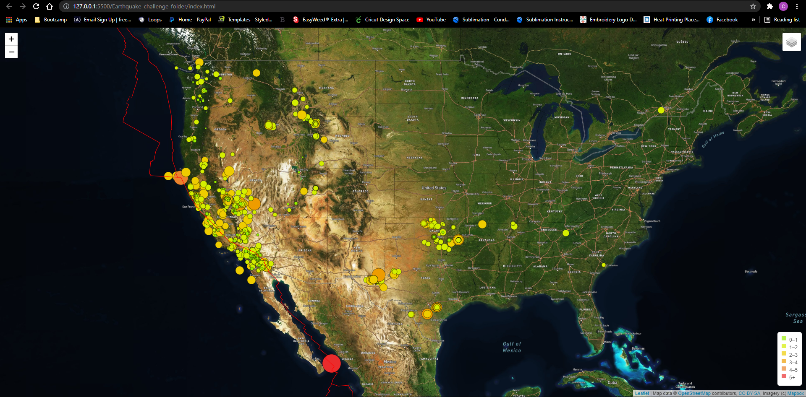

# Mapping_Earthquakes
## Purpose of the Project
To visually display the earthquake data in relation to the tectonic plates’ location on the earth,
also to show all the earthquakes with a magnitude greater than 4.5. 

# Quick Guide
- In the "Earthquake_challenge_folder" you can open the html and see the map with this weeks current earthquakes,
- The legend on the bottom right corner displays the level of magnetitude based of the cirlce color on the map
- If you hover over the circle a popup text box will appear with more entails on the earthquake. 
- You can also chage the display of the map from the layers box in the top right corner.
	- Reference the the image below for a sample of the file. 
	

	
